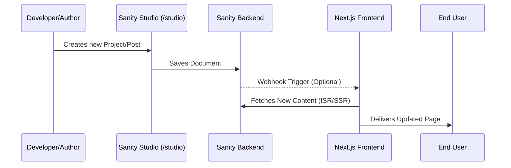

# MeFolio - Modern Developer Portfolio 🚀

     

## 📖 What is MeFolio?

**MeFolio** is a high-performance, aesthetically pleasing, and technically robust personal portfolio template tailored for **Software Engineers**, **SDETs**, and **Designers**. 

It solves the common problem of "Portfolio Paralysis" by bridging the gap between a stunning visual presentation and a powerful Headless CMS. Instead of hardcoding your projects and experience, you manage them in a dedicated dashboard, while the frontend remains a blazing-fast Next.js application.

---

## 🏗 System Architecture

Understanding how MeFolio works under the hood:

```mermaid
graph TD
    User([End User])
    VercelEdge[Vercel Edge Network]
    NextServer[Next.js Server / SSR]
    SanityDL[(Sanity Content Lake)]
    
    User -->|HTTPS Request| VercelEdge
    VercelEdge -->|Cache Hit - Stale While Revalidate| User
    VercelEdge -->|Cache Miss| NextServer
    
    subgraph "The Application"
        NextServer -->|1. Fetch Content (GROQ)| SanityDL
        SanityDL -->|2. Return JSON Data| NextServer
        NextServer -->|3. Render React Components| PageHTML[Static HTML + Hydration]
    end
    
    PageHTML -->|Response| VercelEdge
```

### 🔄 Content Workflow

How data flows from you to your visitors:



---

## 🌟 Key Features

### 👨‍💻 For Developers
*   **Modern Tech Stack**: Built with **Next.js 14+ (App Router)**, **TypeScript**, and **Tailwind CSS v4**.
*   **Clean Architecture**: Separation of concerns with strict TypeScript types (`types/sanity.ts`) and modular components.
*   **Performance First**: Optimized with `next/font` (zero CLS), `next/image` optimization, and extensive use of `dynamic` imports.
*   **Testing Ready**: comprehensive E2E testing setup with **Playwright**.

### ✍️ For Content Creators
*   **Headless CMS**: Integrated **Sanity.io** for real-time management of:
    *   Projects & Case Studies
    *   Work Experience & Education
    *   Skills & Certifications
    *   Blog Posts
*   **Markdown Support**: Write rich content for your case studies and blogs.
*   **Smart Resume**: A dedicated `/resume` route that generates an ATS-friendly, print-optimized resume from your CMS data.

### 🎨 For End Users
*   **Interactive UI**: Smooth animations using **Framer Motion** and **Lenis** for buttery smooth scrolling.
*   **Dark Mode**: Native dark mode support that respects system preferences.
*   **Responsive Design**: Flawless experience across Mobile, Tablet, and Desktop.

---

## 🛠 Tech Stack

| Category | Technology | Description |
| :--- | :--- | :--- |
| **Framework** | [Next.js 14 (App Router)](https://nextjs.org/) | React framework for production with Server Components. |
| **Language** | [TypeScript](https://www.typescriptlang.org/) | Static typing for better developer experience and reliability. |
| **Styling** | [Tailwind CSS v4](https://tailwindcss.com/) | Utility-first CSS framework (Experimental v4). |
| **CMS** | [Sanity v3](https://www.sanity.io/) | Unified Content Platform for structured content. |
| **Animations** | [Framer Motion](https://www.framer.com/motion/) | Production-ready motion library for React. |
| **Testing** | [Playwright](https://playwright.dev/) | Reliable end-to-end testing for modern web apps. |
| **Icons** | [Lucide React](https://lucide.dev/) | Beautiful & consistent icon set. |
| **Deployment** | [Vercel](https://vercel.com/) | The platform for frontend developers. |

---

## 🚀 Getting Started

Follow these steps to get your portfolio running locally.

### 1. Prerequisites
*   Node.js 18+ installed
*   A [Sanity.io](https://www.sanity.io/) account (Free tier is perfect)

### 2. Installation

Clone the repository and install dependencies:

```bash
git clone https://github.com/yourusername/mefolio.git
cd mefolio
npm install
# or
yarn install
```

### 3. Environment Setup

Create a `.env.local` file in the root directory. You'll need your Sanity project details:

```env
NEXT_PUBLIC_SANITY_PROJECT_ID="your_project_id"
NEXT_PUBLIC_SANITY_DATASET="production"
# Optional: Webhook secret for revalidation
SANITY_REVALIDATE_SECRET="your_secret" 
```

### 4. Run Locally

Start the development server:

```bash
npm run dev
```

Visit `http://localhost:3000` to see your portfolio.
Visit `http://localhost:3000/studio` to access the CMS and start adding content.

---

## 📂 Project Structure

```bash
├── app/                  # Next.js App Router (The "View")
│   ├── (website)/        # Public facing pages
│   │   ├── page.tsx      # Home Controller
│   │   ├── projects/     # Project Case Studies
│   │   └── resume/       # Smart Resume Page
│   └── studio/           # Sanity Studio Admin Panel
├── components/           # React Components
│   ├── sections/         # Big page sections (Hero, About, etc.)
│   ├── ui/               # Reusable atomic elements (Buttons, Cards)
│   └── shared/           # Logic-heavy shared components
├── sanity/               # The "Model" (Backend Logic)
│   ├── lib/              # Client & Queries
│   └── schemaTypes/      # Content Schemas (Projects, Experience)
├── types/                # TypeScript Interfaces
└── tests/                # Playwright E2E Tests
```

---

## ✅ Quality Assurance

MeFolio comes with a built-in testing suite to ensure your portfolio never breaks.

```bash
# Run all end-to-end tests
npx playwright test

# Run tests in UI mode (Interactive)
npx playwright test --ui
```

---

## 🛡 License

This project is open-source and available under the [MIT License](LICENSE). Feel free to use it for your own portfolio!

---

<p align="center">
  Designed & Developed with ❤️ by <a href="https://github.com/sirajul-islam">Sirajul Islam</a>
</p>
