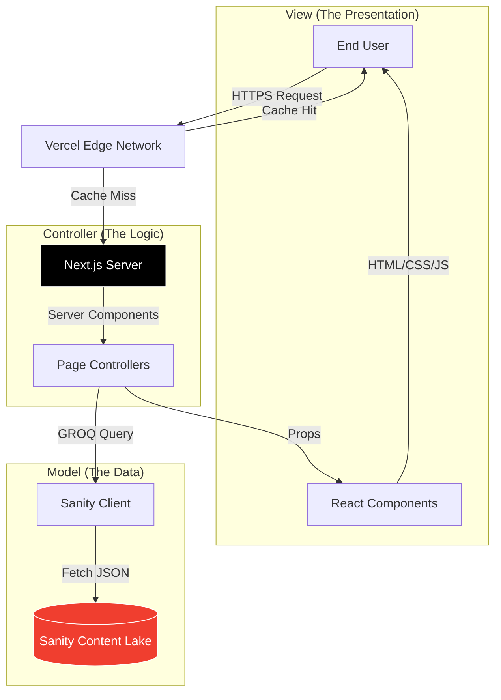

# MeFolio - Modern Developer Portfolio 🚀

 

**MeFolio** is a high-performance, aesthetically pleasing, and technically robust personal portfolio tailored for Software Engineers, SDETs, and Designers. It bridges the gap between a stunning visual presentation and a headless content management system.

[](https://vercel.com/new/clone?repository-url=https://github.com/sirajul-islam/mefolio)

## 🌟 Features

-   **Headless CMS Integration**: Powered by [Sanity.io](https://www.sanity.io/) for real-time content management (Projects, Experience, Education, Skills).
-   **Modern Tech Stack**: Built with **Next.js 14+ (App Router)**, **TypeScript**, and **Tailwind CSS v4**.
-   **Interactive UI**: Smooth animations using **Framer Motion**, **Lenis** (smooth scrolling), and **Shadcn/UI components**.
-   **Structure**: Clean architecture with strict TypeScript types (`types/sanity.ts`) and custom hooks.
-   **Performance**: Optimized with `next/font` (zero CLS) and automatic image optimization.
-   **Live Activity**: **GitHub Contribution Graph** to showcase coding consistency and activity.
-   **Quality Assurance**: Comprehensive E2E testing with **Playwright** and CI/CD pipelines via GitHub Actions.
-   **Dark Mode**: Native dark mode support with system preference detection.

### ✨ New Features (v2.0)

-   **📄 Smart Resume System (`/resume`)**: 
    -   Dedicated route optimizing content from Sanity.
    -   **ATS-Friendly** layout.
    -   **Print-Optimized**: Automatically formats perfectly for PDF export (Cmd+P).
-   **💼 Deep Project Case Studies (`/projects/[slug]`)**: 
    -   Rich text support for "Problem", "Solution", and "Tech Stack".
    -   Image galleries and live demos.
-   **🖼️ Dynamic Social Cards**: 
    -   Auto-generated Open Graph images (`next/og`) for professional link sharing.
-   **☕ Support Kori Integration**: 
    -   Seamless "Buy Me a Coffee" integration in blog posts and footer.

## 📸 Gallery

> *Tip: Replace these placeholders with actual screenshots of your application.*

| Hero Section (Dark Mode) | Sanity Studio (Backend) |
| :---: | :---: |
|  |  |

## 🏗 Architecture & Design Patterns

MeFolio follows a modern **Component-Based Architecture** with a clear separation of concerns, effectively mirroring the **MVC (Model-View-Controller)** pattern:

### System Architecture Diagram



### Data Flow

1.  **Content Creation**: You update content (Add a new Job, specific Skill, or Project) in the **Sanity Studio** (`/studio`).
2.  **Build/Request Time**: Next.js fetches this data using **GROQ** queries defined in `sanity/lib/queries.ts`.
3.  **Rendering**: The data is passed to **Atomic UI Components** (`components/ui/*`) for rendering.
4.  **Client Hydration**: Client-side interactivity (Framer Motion, 3D elements) is hydrated for the user.

## 🛠 Tech Stack

| Category | Technology | Usage |
| :--- | :--- | :--- |
| **Framework** | [Next.js 14 (App Router)](https://nextjs.org/) | Core application framework |
| **Language** | [TypeScript](https://www.typescriptlang.org/) | Type safety and robust code patterns |
| **Styling** | [Tailwind CSS v4](https://tailwindcss.com/) | Utility-first styling system |
| **CMS** | [Sanity v3](https://www.sanity.io/) | Headless content backend |
| **Animations** | [Framer Motion](https://www.framer.com/motion/) | Complex UI transitions and layouts |
| **Icons** | [Lucide React](https://lucide.dev/) | Consistent and clean SVG icons |
| **Testing** | [Playwright](https://playwright.dev/) | End-to-end testing framework |
| **Deployment** | [Vercel](https://vercel.com/) | CI/CD, Hosting, and Edge caching |

## 🚀 Getting Started

### Prerequisites

-   Node.js 18+ installed
-   A [Sanity.io](https://www.sanity.io/) account (Free tier is sufficient)

### Installation

1.  **Clone the repository**:
    ```bash
    git clone https://github.com/yourusername/mefolio.git
    cd mefolio
    ```

2.  **Install dependencies**:
    ```bash
    npm install
    # or
    yarn install
    ```

3.  **Configure Environment Variables**:
    Create a `.env.local` file in the root directory:
    ```env
    NEXT_PUBLIC_SANITY_PROJECT_ID="your_project_id"
    NEXT_PUBLIC_SANITY_DATASET="production"
    ```

4.  **Run the Development Server**:
    ```bash
    npm run dev
    ```

5.  **Access the App**:
    -   Frontend: `http://localhost:3000`
    -   Admin Studio: `http://localhost:3000/studio`

## ✅ Quality Assurance & Testing

This project maintains high code quality standards through automated testing and rigorous type safety.

### Running Tests

```bash
# Run all end-to-end tests
npx playwright test

# Run tests in UI mode (interactive)
npx playwright test --ui

# Run specific test file
npx playwright test tests/navbar.spec.ts
```

### CI/CD Pipeline
- **GitHub Actions**: Automated workflow (`.github/workflows/playwright.yml`) runs on every push and PR.
- **Sanity Integration**: The CI environment securely connects to Sanity.io using GitHub Secrets.

## 🏗 Key Refactoring Highlights

- **Type Safety**: Full TypeScript coverage with custom interfaces in `types/sanity.ts`.
- **Navigation**: Centralized navigation logic using the `useNavigation` hook.
- **Optimization**: Replaced Google Fonts with `next/font` for better performance and privacy.

## 📂 Project Structure

```bash
├── app/                  # Next.js App Router
│   ├── page.tsx          # Home Controller
│   ├── resume/           # Resume Page
│   ├── projects/         # Dynamic Case Study Pages
│   ├── blog/             # Blog & Articles
│   ├── layout.tsx        # Root layout
│   └── studio/           # Sanity Studio route
├── components/           # React Components
│   ├── ui/               # Reusable atomic components
│   └── resume/           # Resume specific components
├── hooks/                # Custom React Hooks
├── types/                # TypeScript Interfaces
├── tests/                # Playwright E2E Tests
├── sanity/               # Backend Logic
│   ├── lib/              # Client & Queries
│   ├── schemaTypes/      # Schema Definitions
└── public/               # Static assets
```

## 🛡 License

This project is open-source and available under the [MIT License](LICENSE).

---

Designed & Developed with ❤️ by [Sirajul Islam](https://github.com/sirajul-islam)
