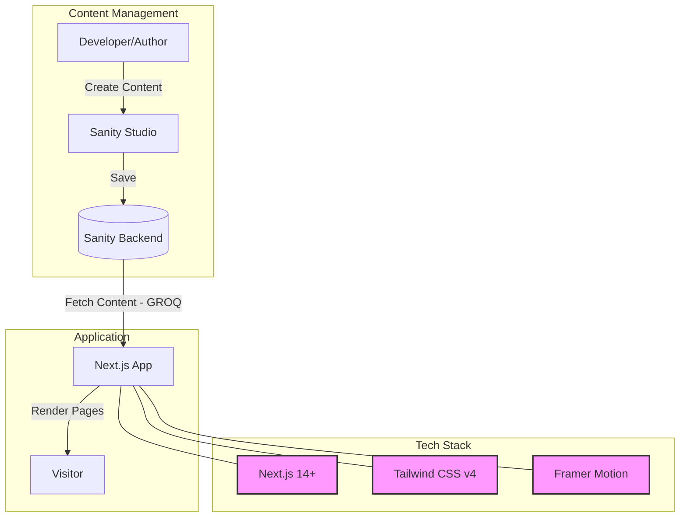

# MeFolio - Modern Developer Portfolio 🚀

     

**MeFolio** is a high-performance, aesthetically pleasing portfolio template tailored for **Software Engineers** and **Designers**. It bridges the gap between a stunning visual presentation and a powerful Headless CMS, solving "Portfolio Paralysis" by managing your content in a dedicated dashboard while the frontend remains a blazing-fast Next.js application.

---

## 🏗 Architecture & Workflow

Here's how MeFolio delivers content from you to your visitors:



---

## 🌟 Key Features

### 👨‍💻 For Developers
*   **Modern Stack**: Next.js 14+ (App Router), TypeScript, Tailwind CSS v4.
*   **Clean Architecture**: Modular components with strict TypeScript types.
*   **Performance**: Optimized images (`next/image`), zero CLS fonts (`next/font`), and dynamic imports.
*   **Testing**: E2E testing with Playwright included.

### ✍️ For Content Creators
*   **Headless CMS**: Sanity.io for managing Projects, Experience, Skills, and Blogs.
*   **Smart Resume**: Auto-generated ATS-friendly resume from CMS data.
*   **Lead Capture**: Custom form to collect visitor details before CV download.

### 🎨 User Experience
*   **Interactive UI**: Smooth animations with Framer Motion and Lenis scrolling.
*   **Dark Mode**: System-preference aware theme switching.
*   **Responsive**: Flawless on Mobile, Tablet, and Desktop.

---

## 🚀 Quick Start

### 1. Setup

Clone and install dependencies:

```bash
git clone https://github.com/yourusername/mefolio.git
cd mefolio
npm install
```

### 2. Environment

Create `.env.local` with your Sanity credentials:

```env
NEXT_PUBLIC_SANITY_PROJECT_ID="your_project_id"
NEXT_PUBLIC_SANITY_DATASET="production"
SANITY_API_TOKEN="sk_..." # Optional: For lead capture
```

### 3. Run

```bash
npm run dev
# App: http://localhost:3000 | Studio: http://localhost:3000/studio
```

---

## 📂 Structure Overview

```bash
├── app/                  # Next.js App Router
│   ├── (website)/        # Public pages (Home, Projects, Resume)
│   └── studio/           # Sanity Studio Admin
├── components/           # React Components
│   ├── sections/         # Page sections
│   └── shared/           # reusable logic/UI
├── sanity/               # Backend Logic & Schemas
└── tests/                # Playwright E2E Tests
```

---

## ✅ Quality Assurance

Run the test suite to ensure stability:

```bash
npx playwright test
```

---

## 🛡 License

MIT License. Designed & Developed with ❤️ by [Sirajul Islam](https://github.com/sirajul-islam).
