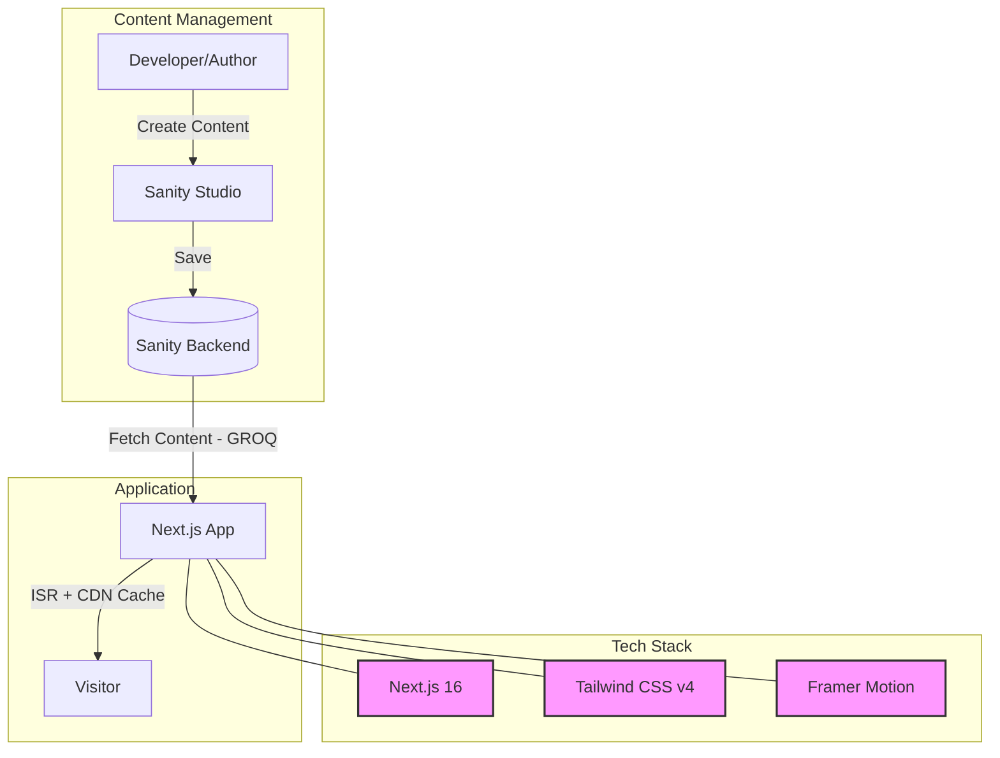

# MeFolio - Modern Developer Portfolio 🚀

     

**MeFolio** is a high-performance, aesthetically pleasing portfolio template tailored for **Software Engineers** and **Designers**. It bridges the gap between a stunning visual presentation and a powerful Headless CMS, solving "Portfolio Paralysis" by managing your content in a dedicated dashboard while the frontend remains a blazing-fast Next.js application.

---

## 🏗 Architecture & Workflow

Here's how MeFolio delivers content from you to your visitors:


```mermaid
graph TD
    subgraph "Content Management"
        You[Developer/Author] -->|Create Content| Studio[Sanity Studio]
        Studio -->|Save| DB[(Sanity Backend)]
    end

    subgraph "Application"
        DB -->|Fetch Content - GROQ| App[Next.js App]
        App -->|ISR + CDN Cache| User[Visitor]
    end

    subgraph "Tech Stack"
        App --- Next[Next.js 16]
        App --- Tail[Tailwind CSS v4]
        App --- Motion[Framer Motion]
    end

    classDef tech fill:#f9f,stroke:#333,stroke-width:2px;
    class Next,Tail,Motion tech;
```

---

## 🌟 Key Features

### 👨‍💻 For Developers
*   **Modern Stack**: Next.js 16 (App Router), TypeScript, Tailwind CSS v4.
*   **Clean Architecture**: Modular components with strict TypeScript types.
*   **Performance**: ISR caching, AVIF/WebP image optimization, staged data fetching, and dynamic imports.
*   **AI-Readable**: `llms.txt` support so AI assistants can read your portfolio when a link is shared.
*   **Testing**: E2E testing with Playwright included.

### ✍️ For Content Creators
*   **Headless CMS**: Sanity.io for managing Projects, Experience, Skills, and Blogs.
*   **Auto Sitemap**: Dynamically generated sitemap including all blog posts and projects.
*   **Smart Resume**: Auto-generated ATS-friendly resume from CMS data.
*   **Lead Capture**: OTP-verified form to collect visitor details before CV download.

### 🎨 User Experience
*   **Interactive UI**: Smooth animations with Framer Motion and Lenis scrolling.
*   **Dark Mode**: System-preference aware theme switching.
*   **Responsive**: Optimised for Mobile (5"), Tablet, and Desktop.

---

## 🚀 Quick Start

### 1. Setup

Clone and install dependencies:

```bash
git clone https://github.com/yourusername/mefolio.git
cd mefolio
npm install
```

### 2. Environment

Create `.env.local` with your credentials:

```env
# Sanity CMS (required)
NEXT_PUBLIC_SANITY_PROJECT_ID="your_project_id"
NEXT_PUBLIC_SANITY_DATASET="production"
SANITY_API_TOKEN="sk_..."         # Required for contact form & lead capture

# Site URL (required for sitemap, OG tags, canonical URL)
NEXT_PUBLIC_BASE_URL="https://yourdomain.com"

# Email via Resend (required for OTP / resume download)
RESEND_API_KEY="re_..."
RESEND_FROM_EMAIL="hello@yourdomain.com"

# Analytics (optional)
NEXT_PUBLIC_GA_MEASUREMENT_ID="G-..."
NEXT_PUBLIC_CLARITY_PROJECT_ID="..."
NEXT_PUBLIC_POSTHOG_KEY="..."
```

### 3. Run

```bash
npm run dev
# App: http://localhost:3000 | Studio: http://localhost:3000/studio
```

---

## 📂 Structure Overview

```bash
├── app/                  # Next.js App Router
│   ├── (website)/        # Public pages (Home, Blog, Projects)
│   ├── api/              # API routes (contact, send-otp, verify-otp)
│   ├── robots.ts         # robots.txt generation
│   ├── sitemap.ts        # Dynamic sitemap (includes all posts & projects)
│   └── studio/           # Sanity Studio Admin
├── components/           # React Components
│   ├── sections/         # Page sections (Hero, Blog, Projects, etc.)
│   └── shared/           # Reusable UI components
├── lib/                  # Utilities (OTP store, rate limiter, etc.)
├── public/
│   └── llms.txt          # AI-readable site summary for LLM crawlers
├── sanity/               # Sanity schemas & GROQ queries
└── tests/                # Playwright E2E Tests
```

---

## ⚡ Performance

*   **ISR (Incremental Static Regeneration)**: Blog and project pages are pre-rendered at build time and cached on Vercel's CDN. Content refreshes automatically every 60 seconds — no cold render on link share.
*   **Staged Data Fetching**: Above-fold (Hero) data is fetched first to unblock initial paint. Below-fold sections load in parallel.
*   **Image Optimization**: AVIF/WebP served automatically via Next.js image CDN. Sanity images use `auto=format&q=80` for ~40% smaller files.
*   **Dynamic Imports**: All below-fold sections lazy-loaded via `next/dynamic` to minimize initial JS bundle.

---

## 🔒 Security

*   **OTP Brute-Force Protection**: OTPs are invalidated after 3 failed attempts.
*   **API Rate Limiting**: IP-based rate limiter on the contact form (max 3 per 24 hours).
*   **Disposable Email Blocking**: Blocks known temporary email services.
*   **MX Record Validation**: DNS check ensures the email domain can actually receive mail.

---

## ✅ Quality Assurance

Run the test suite to ensure stability:

```bash
npx playwright test
```

---

## 🛡 License

MIT License. Designed & Developed with ❤️ by [Sirajul Islam](https://github.com/sirajul-islam).
